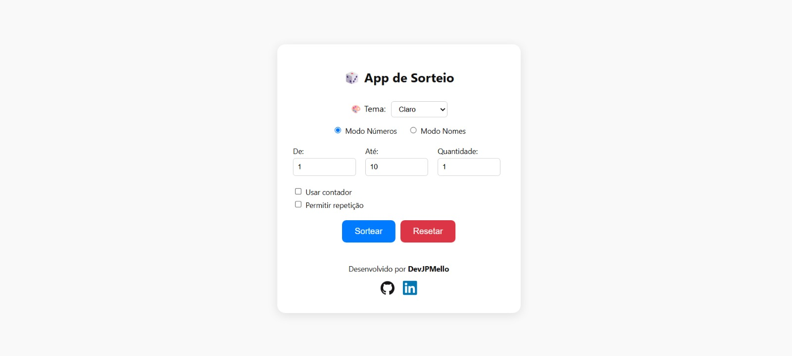

# 🎲 App de Sorteio

Um aplicativo interativo para realizar sorteios de números ou nomes com diversas funcionalidades, temas personalizados e animações, desenvolvido com React.

# 🚀 Funcionalidades

- ✅ Sorteio de números com ou sem repetição

- ✅ Sorteio de nomes a partir de listas

- ✅ Histórico de sorteios com botão para limpar

- ✅ Contador regressivo opcional

- ✅ Modo escuro, claro, cyberpunk e retrô 🌈

- ✅ Confete ao sortear 🎉 (canvas-confetti)

# 🖼️ Interface

- A interface é responsiva e amigável, com destaque para a experiência visual e facilidade de uso:

- 🎨 Alteração de tema com seletor visual

- 🧾 Entrada de nomes com suporte a vírgulas e quebras de linha

- 🔒 Sorteios seguros sem repetições involuntárias

- 📦 Instalação Local

 # 🔧 Tecnologias

- React + Vite

- CSS puro com suporte a temas

- canvas-confetti

# Clone o repositório
git clone https://github.com/devJPMello/app-de-sorteio.git
cd app-de-sorteio

# Instale as dependências
npm install

# Rode o app
npm start

Acesse: http://localhost:3000

# 📄 Licença

Este projeto está licenciado sob a Licença MIT.

"Sorte é o encontro da preparação com a oportunidade." 🍀
